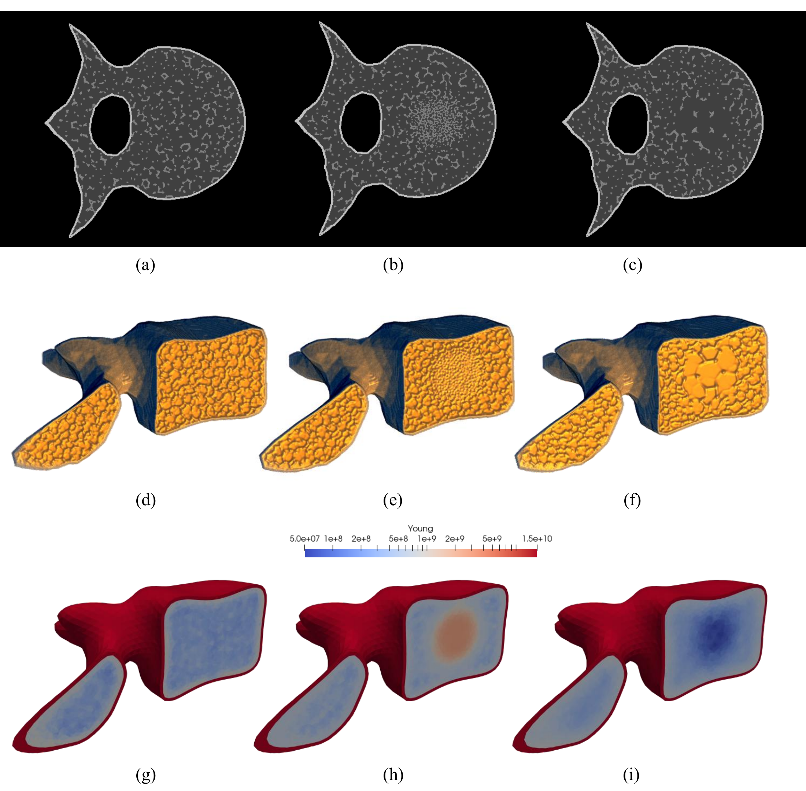
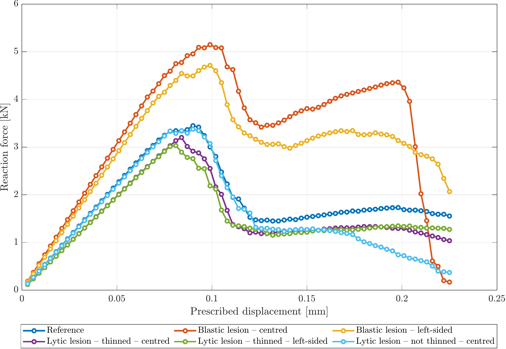
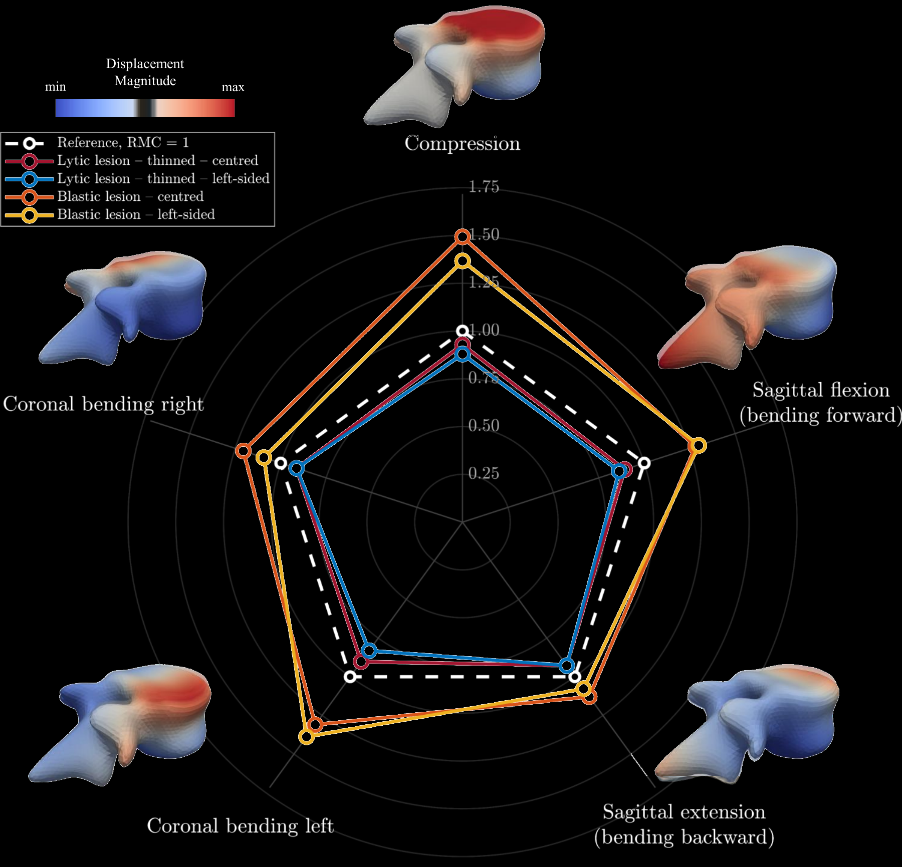
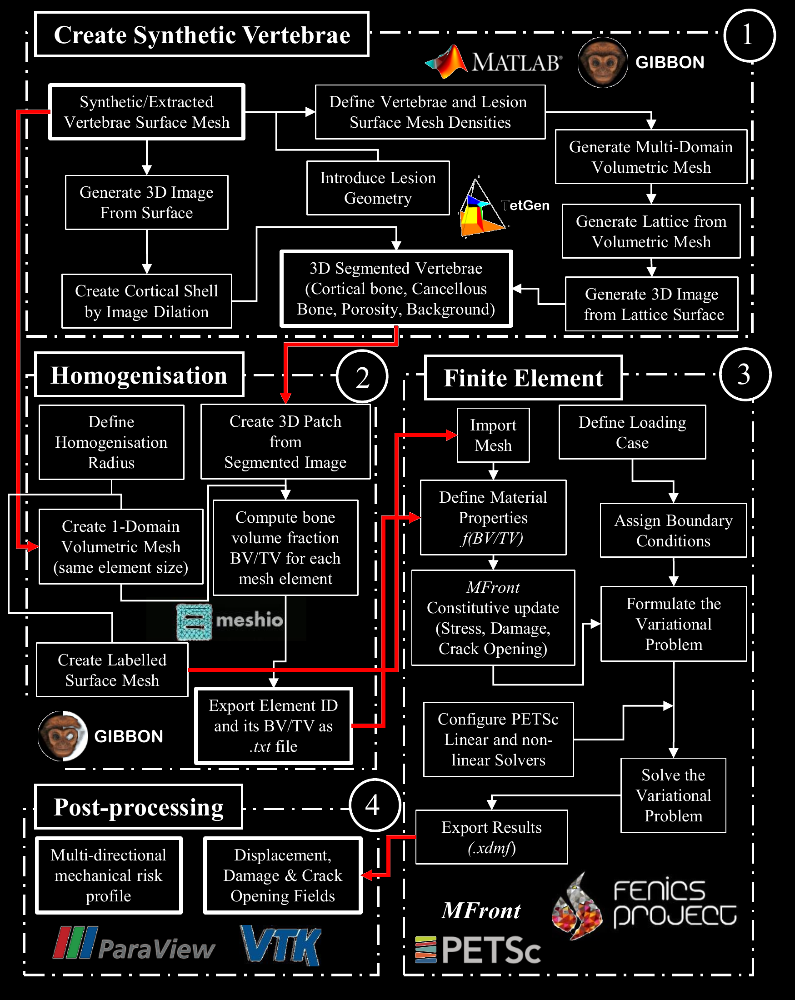

# VERITAS

**VERtebral Image-based fracTure risk Assessment Simulator**

VERITAS is a modular computational framework for generating synthetic healthy and pathological vertebrae and studying vertebral failure through image-informed nonlinear finite element analysis. It combines controllable bone and lesion morphology, homogenisation of local bone volume fraction (BV/TV), and a Mazars-type continuum damage model. Compression and bending simulations provide mechanical capacity, displacement, damage and crack-opening fields to investigate the effects of lesion type, lesion location and cortical shell integrity.

The geometry and material-field pipeline is implemented in [Julia](https://julialang.org/) using [COMODO](https://github.com/COMODO-research/Comodo.jl), alongside original functions and functions translated into Julia from the [GIBBON project](https://www.gibboncode.org/). The nonlinear mechanical analysis uses Python/[FEniCSx](https://fenicsproject.org/) coupled with MFront for the constitutive behaviour. Reusable functions are organised in `src/`, with case-specific inputs and execution scripts in `caseStudies/`.

## Representative results

The following figures illustrate material-field construction and mechanical responses reported in the paper draft.

### Figure 2: Image-informed material fields for healthy and pathological vertebrae



Representative image slices show (a) the reference vertebra, (b) a blastic lesion and (c) a lytic lesion. Panels (d–f) show the corresponding clipped 3D image volumes, while (g–i) show the resulting Young's modulus fields obtained through image-informed homogenisation.

### Figure 3: Force–displacement response of the reference and pathological vertebral models under uniform compression.



The curves show vertical reaction force against prescribed displacement for the reference vertebra, centred and left-sided blastic lesions, and lytic lesions with or without cortical shell thinning. They compare predicted stiffness, peak load-bearing capacity and post-peak degradation across the six configurations.

### Figure 4: Relative mechanical capacity across compression and bending load cases



Relative mechanical capacity (RMC) compares the pathological models with the reference vertebra under compression, sagittal flexion, sagittal extension, and left and right coronal bending. Compression is assessed using peak reaction force, and bending using peak bending moment. The dashed reference profile corresponds to RMC = 1; values below or above one indicate reduced or increased mechanical capacity, respectively. These representative results are from the paper draft.

## Installation and reference case

See [INSTALLATION.md](INSTALLATION.md) for the Ubuntu 24.04 / WSL 2 setup, dependency installation and verification steps.

From the repository root, after installing the dependencies:

Run the Julia stage from a shell without an active Conda environment:

```bash
julia --project=. caseStudies/reference/main.jl
```

The Julia stage generates the mesh and element-wise material fields. Its mesh converter uses the Python interpreter in `~/miniforge3/envs/veritas/bin/python` without requiring Conda activation. If that environment is installed elsewhere, set `VERITAS_PYTHON` to the full path of its Python executable before running Julia.

Then activate the Conda environment for the FEniCSx analysis:

```bash
conda activate veritas
python src/finiteElement/run_mazars.py --case-dir caseStudies/reference
```

The Python stage reads the generated mesh and material fields and runs the nonlinear mechanical analysis.

## VERITAS workflow

### Figure 1: Overview of the VERITAS workflow from synthetic vertebra generation to image-informed nonlinear finite element analysis and mechanical risk profiling.



The workflow connects synthetic vertebra generation, image-informed homogenisation, nonlinear finite element analysis and post-processing. The diagram is reproduced from the paper draft and depicts the original MATLAB/GIBBON implementation; the geometry and homogenisation stages in this repository use Julia/Comodo.

## Repository architecture

```text
VERITAS/
├── caseStudies/
│   ├── reference/
│   │   ├── input/
│   │   ├── main.jl
│   │   ├── mesh/
│   │   ├── images/
│   │   └── data/
│   │
│   ├── blastic_centered/
│   │   ├── input/
│   │   ├── main.jl
│   │   ├── mesh/
│   │   ├── images/
│   │   └── data/
│   │
│   ├── blastic_noncentered/
│   │   ├── input/
│   │   ├── main.jl
│   │   ├── mesh/
│   │   ├── images/
│   │   └── data/
│   │
│   ├── lytic_centered/
│   │   ├── input/
│   │   ├── main.jl
│   │   ├── mesh/
│   │   ├── images/
│   │   └── data/
│   │
│   └── lytic_noncentered/
│       ├── input/
│       ├── main.jl
│       ├── mesh/
│       ├── images/
│       └── data/
│
├── src/
│   ├── syntheticVertebrae/
│   ├── homogenisation/
│   ├── finiteElement/
│   └── postprocessing/
│
├── install/
├── install.sh
├── environment.yml
├── Project.toml
├── Manifest.toml
├── INSTALLATION.md
├── LICENSE
└── README.md
```

## Structure

### `caseStudies/`

Each case study contains its own `main.jl` file and its associated inputs and outputs.

- `input/` — input geometry and case-specific data
- `main.jl` — case-specific configuration and pipeline execution
- `mesh/` — generated surface and volumetric meshes
- `images/` — generated images and visual outputs
- `data/` — numerical and auxiliary output data

The initial case-study layout comprises `reference`, `blastic_centered`, `blastic_noncentered`, `lytic_centered` and `lytic_noncentered`. The reference case is the entry point for the current pipeline. The FEniCSx solver writes its results to `caseStudies/reference/output/fenicsx/` by default.

### `src/`

Reusable functions shared by the case studies are organised according to the main VERITAS pipeline stages:

- `syntheticVertebrae/` — synthetic vertebra generation and mesh construction
- `homogenisation/` — material homogenisation and property mapping
- `finiteElement/` — mesh conversion, finite element models, solvers and the MFront behaviour library
- `postprocessing/` — analysis, visualisation and result processing

Each `main.jl` case-study script calls the common functions in `src/` rather than duplicating their implementation. The reusable FEniCSx runner, `src/finiteElement/run_mazars.py`, selects its inputs through `--case-dir`.
